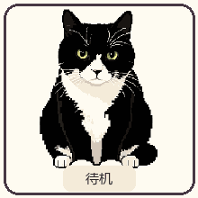

# 虾虾桌宠

把家里的黑白奶牛猫虾虾，变成一只会待机、散步和打盹的 Windows 像素桌宠。



## 功能

- 透明、无边框、始终置顶的小窗口；非猫咪轮廓区域会把鼠标点击交给桌面上的其他窗口。
- 左键按住猫咪可拖动。右键菜单可让咪咪眨眼、跳跃、喵叫、散步，或者切换休息状态。
- 系统托盘右键菜单可切换休息状态或退出；左键单击托盘也能切换休息。
- 通过 Windows 全局空闲输入检测挂机；连续 3 分钟没有键盘或鼠标输入时，咪咪会趴下睡觉。
- GIF 格式的中文 README 演示图，MIT 许可证。

## 下载并启动

打开 [GitHub Releases](https://github.com/Xiooo-oo/xio-cat-deskpet/releases/latest)，下载 `xiaxia-deskpet-0.1.0-x64-setup.exe`，双击并按安装向导完成安装。之后在 Windows 开始菜单搜索“咪咪桌宠”并启动。桌宠窗口出现后，右键猫咪可打开动作菜单，选择“走两步”播放行走动画。也可以下载 ZIP 版本，解压后运行其中的安装程序。

首版安装包尚未签名。若 Windows 显示 Microsoft Defender SmartScreen 的“Windows 已保护你的电脑”，确认文件来自本仓库后，可选择“更多信息 → 仍要运行”。启用 Smart App Control 的电脑可能会直接阻止未签名应用；此时安装包无法保证运行。

## Windows 开发

需要 Windows 10/11、Node.js 20.19+ 或 22.12+、Rust stable 工具链，以及 WebView2 Runtime。首次构建需要联网下载 npm 与 Cargo 依赖。

```powershell
npm install
npm run tauri dev
```

仅预览猫咪、动画和右键动作菜单（不启动 Rust/Tauri）：

```powershell
npm run dev
```

然后打开终端显示的本机网址，通常为 `http://127.0.0.1:1420`。浏览器预览不包含系统托盘、窗口置顶、系统级挂机检测或桌面点击穿透。

生成 Windows 安装包：

```powershell
npm run tauri build
```

安装包位于 `src-tauri/target/release/bundle/`，包含 NSIS 安装程序和 MSI。

## GitHub 云端构建

仓库包含 `.github/workflows/windows-build.yml`。把代码推送到 `main` 后，GitHub Actions 会在 Windows 云端生成 x64 安装包；也可以在仓库的 **Actions → Windows build → Run workflow** 手动启动。完成后从运行页面的 **Artifacts** 下载。

此工作流生成的是未签名安装包。首版可以先这样发布；Windows 可能对新下载的程序显示安全提示。如果提示是 Microsoft Defender SmartScreen 的“Windows 已保护你的电脑”，并且你确认安装包来自本仓库且信任它，可以点击“更多信息 → 仍要运行”（英文界面为“More info → Run anyway”）。

启用了 Smart App Control 的电脑可能直接阻止未知的未签名程序，届时不一定会显示“仍要运行”选项。请不要把 SmartScreen 的操作方法描述成能绕过 Smart App Control，也不要要求用户关闭系统防护。要让更多开启 Smart App Control 的用户运行桌宠，需要为应用二进制文件和安装包配置受信任的代码签名，并在此类 Windows 设备上验证。证书私钥和密码仅应保存在 GitHub Actions Secrets 中，不能提交到仓库。

### 生成已签名的 Windows 安装包

仓库还提供手动触发的 `.github/workflows/windows-signed-build.yml`。先向受信任的证书颁发机构申请 Windows 代码签名证书（Smart App Control 要求使用受信任 CA 的 RSA 证书；SSL 证书和自签名证书不适用）。将带私钥的证书导出为 `.pfx`，设置导出密码，然后在 PowerShell 中将 PFX 转成 Base64：

```powershell
[Convert]::ToBase64String([IO.File]::ReadAllBytes('C:\path\to\codesign.pfx')) | Set-Clipboard
```

在 GitHub 仓库打开 **Settings → Secrets and variables → Actions → New repository secret**，新增：

- `WINDOWS_CERTIFICATE_BASE64`：上一步复制的 Base64 字符串。
- `WINDOWS_CERTIFICATE_PASSWORD`：导出 PFX 时设置的密码。

之后到 **Actions → Windows signed build → Run workflow** 启动签名构建。完成后从该次运行的 **Artifacts** 下载 `mimi-deskpet-windows-x64-signed`。工作流会验证安装包签名；证书只在临时 GitHub runner 中导入，PFX 文件会在导入后删除。不要把 PFX、密码或私钥提交到 GitHub，也不要发到聊天中。

新程序的下载仍可能出现 SmartScreen 信誉提示；签名提供可信发布者身份，并让后续版本逐步累积信誉。Smart App Control 对未签名或不受信任的程序可能直接阻止运行。发布版本应持续使用同一证书，并在开启 Smart App Control 的 Windows 设备上验证。

## 项目结构

```text
src/                  Svelte 桌宠界面和动作
src-tauri/            Tauri 窗口、托盘及 Windows 输入监测
public/cats/           去背景后的猫咪透明 PNG 帧
assets/source/         原始猫咪像素图
docs/demo.gif          动作预览
scripts/prepare_assets.py  从原图重做透明帧、演示 GIF 和应用图标
```

桌宠动作使用提供的坐姿、趴睡姿态和三张行走姿态。眨眼、跳跃、呼吸动画由界面驱动；喵叫使用浏览器音频合成，因此不需要额外音频文件。素材脚本优先读取仓库里的 `assets/source/`；首次从新原图生成时，可在 PowerShell 里设置 `$env:CAT_DESKPET_SOURCE` 指向图片目录，然后运行 `python scripts/prepare_assets.py`。

## 素材与许可

程序代码、文档与本仓库中的桌宠素材按 MIT 许可证发布，详见 [LICENSE](LICENSE)。发布到公开仓库前，请确认原图及其衍生素材适用于你的发布场景。
